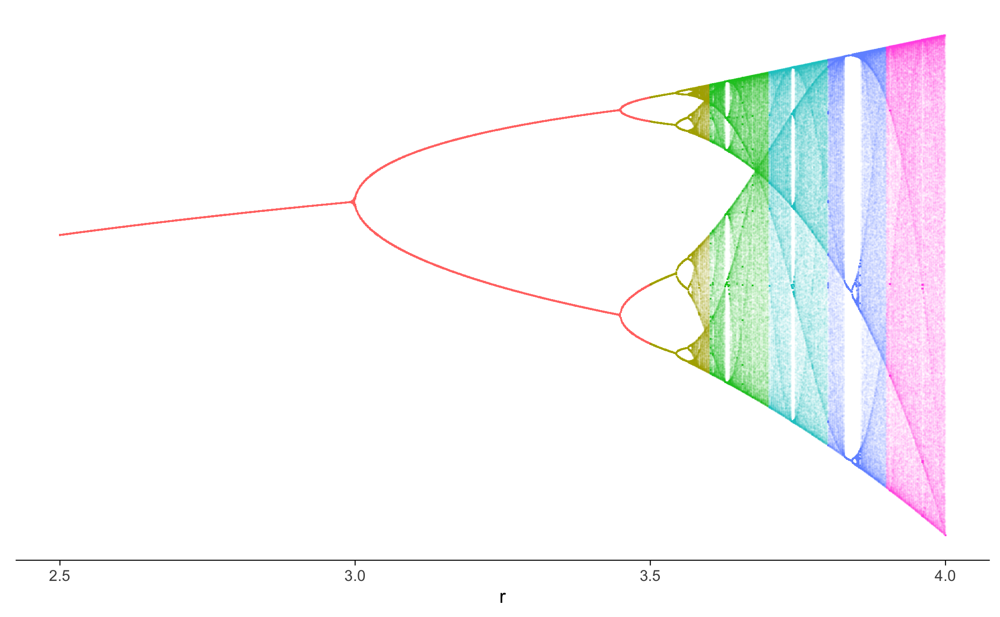
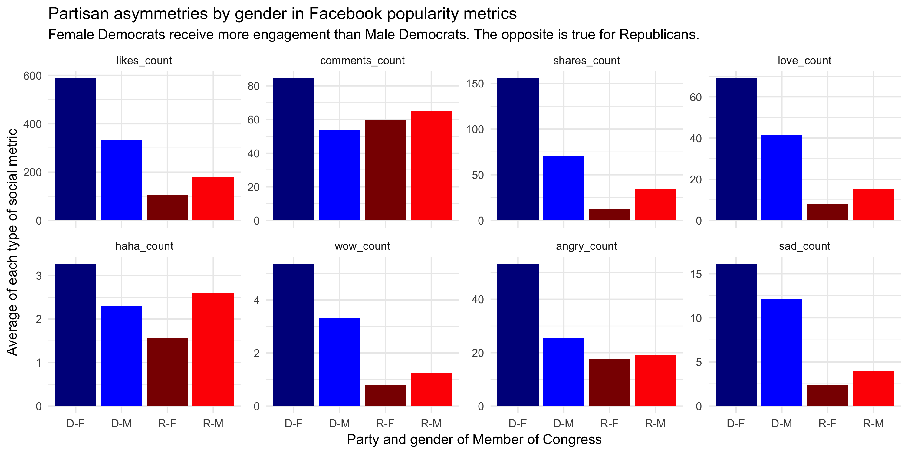
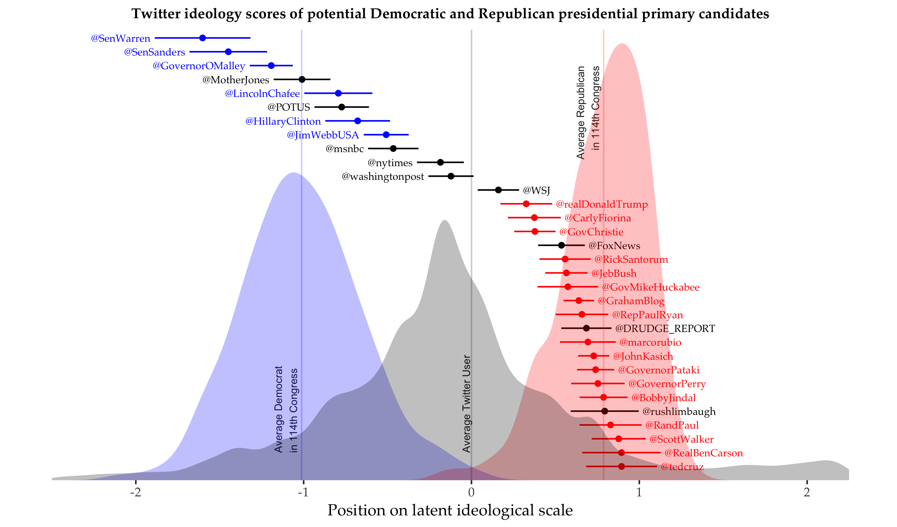

# Assignment 2

```{r}
options(repos = list(CRAN="http://cran.rstudio.com/"))

# Load packages here
library("ggthemes")
library("tidyverse")
library("ggplot2")
library("plyr")
library("dplyr")
library("plotly")
library("gganimate")
library("scales")
```

## 1. Chaos (19 points)

In this exercise, the goal is to create one of the most famous plots in chaos theory. The equation of the [logistic map](https://en.wikipedia.org/wiki/Logistic_map) is very simple, but its behaviour stunningly complex:

$$
x_{n+1} = rx_{n}(1-x_{n})
$$

Starting with an initial value of $x_{0}$ between one and zero, e.g. 0.5, and setting a constant value of r e.g. between zero and four, the equation is iterated forward and thereby computes $x_{1}, x_{2}$, etc. We will only care about visualisation here, but if you are interested in learning more about the background of the equation and plot, e.g. have a look at [this](https://youtu.be/ovJcsL7vyrk) or [this]( https://youtu.be/ETrYE4MdoLQ) video.

The goal is to create a plot with different values of r on the x-axis and then x values on the y-axis corresponding to each r value. In parts of the plot, all these x values will be on a single point, but for other r values x moves perpetually.

The following code chunk computes the main dataset of the plot for you. You are welcome to study the code, but this is not part of the assignment and you do not have to worry about how exactly it works (this is not a course about chaos theory after all). Data contained in `logistic_map_data` is already in a tidy format, one variable denotes the value of r, one variable the value of the associated x's. For each value of r repeated over $n=1000$ rows, there are $n$ associated rows of x values (these can be constant or fluctuating, depending on the value of r). Only some information for the colour still has to be added.

```{r}
# x observations for each r value
n <- 1000
# Step between each r value
r_step <- 0.001

r_range <- seq(2.5, 4, by = r_step)
to_discard <- 500 # numbers of observations discarded before the n which are stored
logistic_map_data <- matrix(0, nrow = n*length(r_range), 2)
for (r in r_range) {
  
  current_logistic_map_series <- numeric(n+to_discard)
  current_logistic_map_series[1] <- 0.5
  
  for (k in 1:(n+to_discard-1)) {
    
    current_logistic_map_series[k+1] <- r*current_logistic_map_series[k]*(1-current_logistic_map_series[k])
    
  }
  
  start_index <- 1+n*(match(r, r_range) - 1)
  end_index <- n*match(r, r_range)
  
  logistic_map_data[start_index:end_index,1] <- r
  logistic_map_data[start_index:end_index,2] <- tail(current_logistic_map_series,n)

}

logistic_map_data <- as_tibble(data.frame(logistic_map_data))
colnames(logistic_map_data) <- c("r", "x")
```

Hint: Create your final dataset with `n <- 1000` and `r_step <- 0.001`, however, for these values it takes R some time to compute the plot. When building your plot, adjusting axes, colours, etc., one approach is to first use e.g. `n <- 10` and `r_step <- 0.01` until you have a version of the plot that you are happy with. Just note that the opacity parameter will have to be decreased again once you have increased `n` because now there are more points in the plot.


```{r}
# Your code here

head(logistic_map_data)

#Creating a point plot with r and x
pBW <- ggplot(logistic_map_data, aes(x = r, y = x, colour=r )) + 
        geom_point(size = 0.01, alpha=0.01 )
                    
#Removing y-axis label, graph background and legend
pStripped <- pBW + theme(panel.background = element_blank(), axis.text.y=element_blank(),
      axis.ticks.y=element_blank(), axis.title.y = element_blank(), 
      legend.position = "None")

#Adding colour to the graph
pRainbow <- pStripped + binned_scale(scale_name="stepsn",palette = function(x) c("#FF6161", "#B7B730","#25BF25","#91DEDE","#CAD4FF","#FFB3F3"),breaks=c(3.5,3.6,3.7,3.8,3.9),aesthetics = "color")

pRainbow

```


                                

## 2. Popularity metrics by party and gender (19 points)

In this exercise, try to replicate the following figure that displays the average popularity metrics of legislators grouped by gender and party. Note that this example first involves some reshaping of the data which you can do with `dplyr` from the `tidyverse`.

```{r}
# Data for the plot
fb <- read.csv("data/fb-congress-data.csv", stringsAsFactors=FALSE)
```

```{r}
# Your code here
table(fb$party)

#Choosing only relevant columns and party
fb <- fb[ , c(5, 6, 7, 8, 9, 10, 11, 12, 13, 15)]
fb <- fb[fb$party == 'Democrat' | fb$party == 'Republican',]

table(fb$party)
colnames(fb)

#Joining gender and party
fb <- fb %>%
  unite("GP", gender:party)

#Gathering data
new_fb <- gather(fb, key="measure", value="value", c("likes_count", "comments_count", "shares_count", "love_count", "haha_count", "wow_count", "angry_count", "sad_count"))

#Changing strings names data
new_fb$GP = gsub("M_Democrat","D-M",new_fb$GP)
new_fb$GP = gsub("F_Democrat","D-F",new_fb$GP)
new_fb$GP = gsub("M_Republican","R-M",new_fb$GP)
new_fb$GP = gsub("F_Republican","R-F",new_fb$GP)

new_fb = new_fb %>% 
  mutate(value=replace_na(value,0))


#Plotting bar chart
ggplot(new_fb,aes(x=GP, y =value, fill= GP))+
  geom_bar(stat = "summary",fun = 'mean')+
  theme(legend.position = "none")+
  facet_wrap(~measure,scales = "free",nrow=2)+guides(fill="none")+
    labs(title = "Partisan asymmetries by gender in Facebook popularity metrics",
       subtitle = "Female Democrats receive more engagement than Male Democrats. The opposite is true for Republicans",
       x = "Party and Gender of Member of Congress",
       y = "Average of each type of social metric")+
  scale_y_continuous(labels = comma) +
  scale_color_manual(values = c("dark blue", "blue", "dark red", "red"), aesthetics = "fill")+
  theme_minimal()

```



## 3. Ideology of presidential candidates in the US (22 points)

For this exercise, try to replicate the plot below, which Pablo Barbera prepared for a [Washington Post blog post](https://www.washingtonpost.com/news/monkey-cage/wp/2015/06/16/who-is-the-most-conservative-republican-candidate-for-president/?utm_term=.081a276328ad) a few years ago.

The plot combines two sources of data: The ideology estimates for each actor (available in `ideology_1.csv`) and a random sample of ideology estimates for the three density plots (in `ideology_2.csv`).

As a clue, Pablo used `theme_tufte` from the `ggthemes` package as main theme (which he then edited manually). But there may be other ways of replicating it.

```{r}
# Data for main plot
ideology <- read.csv("data/ideology_1.csv")
view(ideology)

# Data for background plots
bg <- read.csv("data/ideology_2.csv")
head(bg)

```


```{r}
# Your code here

#Plotting main plot

#Generate row number or row index to table
ideology <- dplyr::mutate(ideology, id = (row_number()/20))
head(ideology)

#Baseline
i <- ggplot(ideology, mapping = aes(x=twscore, y=id, xmin=twscore-twscore.sd, xmax=twscore+ twscore.sd, colour = party, label=screen_name)) + 
    geom_pointrange(size=0.1) + 
     geom_text(size=2, hjust=1,nudge_x=-0.15)

#Adding colour
cols <- c('Republican' = 'red', 'Z' = 'black', 'Democrat' = 'blue')
iCol <- i + scale_color_manual(name = 'Party',values= cols)

#Adding theme and Removing background axis
iStripped <- iCol + theme_tufte() + theme(axis.text.y=element_blank(),
      axis.ticks.y=element_blank(), axis.title.y = element_blank(), 
      legend.position = "None") + labs(x = "Position on latent ideological scale", subtitle="Twitter Ideology scores of potential Democratic and Republican presidential primary candidates")

iStripped
```
```{r}
#Plotting background plots

#Baseline
l <- ggplot(bg, aes(x=ideology, fill=type)) +
       geom_density(alpha=0.2, color=NA) +
       scale_x_continuous(limits = c(-2.5, 2.5))

#Adding colour and theme
lCol <- l + scale_color_manual(name = 'Party',values= cols, aesthetics = "fill") + theme_tufte()

#Calculating average
avg <- ddply(bg, "type", summarise, grp.mean=mean(ideology))
avg <- avg[-3,]

#Adding intercepts
lLines <- lCol + geom_vline(xintercept= 0, size=0.1, color="black") + geom_vline(data=avg, aes(xintercept=grp.mean, color=type), size=0.1) + scale_color_manual(values=c("blue", "red", "black"))

#Adding labels to intercepts
lLabel <- lLines + annotate("text", x=0.1, y=1, label= "Average Twitter Score", size=2.5, angle = 90) +
    annotate("text", x=-1.1, y=0.5, label= "Average Democrate\n in 114th congress", size=2.5, angle = 90) + 
    annotate("text", x=0.7, y=1.2, label= "Average Republican\n in 114th congress", size=2.5, angle = 90)

#Adding theme and Removing background axis
lStripped <- lLabel + theme_tufte() + theme(axis.text.y=element_blank(),
      axis.ticks.y=element_blank(), axis.title.y = element_blank(), 
      legend.position = "None") + labs(x = "Position on latent ideological scale", subtitle="Twitter Ideology scores of potential Democratic and Republican presidential primary candidates")
lStripped

```

I attempted to plot both graphs together in one, unfortunately I was not able to fix the sizing and proportion. Code for plotting both on same scale below:

```{r}
#Merging plots together
lfinal <- lStripped + geom_pointrange(data=ideology, mapping=aes(x=twscore,y=id, xmin=twscore-twscore.sd, xmax=twscore+twscore.sd, colour = party))

lfinal2 <- lfinal + 
          geom_text(ideology, mapping = aes(x=twscore, y=id, colour = party, label=screen_name,  hjust=1,nudge_x=-0.15))
lfinal2

```




## 4. Own visualisation (40 points)

In this exercises you can visualise data about a topic you are interested in.

First download the data. If you are looking for ideas, e.g. have a look at health data from the [World Health Organization](https://www.who.int/data/gho), economic data from the [St. Louis Federal Reserve](https://fred.stlouisfed.org/), or data on wealth and income inequality from the [World Inequality Database](https://wid.world/data/). Once you have downloaded the data, load it into R and process it, and then explore and illustrate it with plots created with `ggplot2` and/or `plotly`. You can also add brief explanations through markdown text.

More extensive, carefully thought out, polished, and well understandable answers will receive more points.

Note: Some of these data can also be obtained via APIs, but you can just manually download files such as .csv. for this assignment. This has no effect on the grade.


For this exercise, I am using an open source dataset which contains ratings of movies from year 2007 to 2011.
```{r}
# Your code here
dataset <- read.csv("data/Movie_Ratings_data.csv")
head(dataset)

colnames(dataset) <- c("Film", "Genre", "CriticalRating", "AudienceRating", "BudgetMillions", "Year")

#Analysing tail of dataset
tail(dataset)
#Analysing structure of dataset
str(dataset)
#Getting stats for the dataset
summary(dataset)
#Getting all column names
colnames(dataset)

#Calculating average of ratings for each genre
avgGenre<- ddply(dataset, "Genre", summarise, Audience.mean=mean(AudienceRating), Critical.mean=mean(CriticalRating))
avgGenre
```

Using plotly, the visualisation represents the whole dataset. The critical rating can be compared to audience rating; sizes of the point represents budget size, and each genre is given a specific colour.

```{r}
#Plotting critical rating against audience rating, size represent budget and colour genre
movies <- ggplot(dataset, aes(x=CriticalRating, y=AudienceRating, colour=Genre, size=BudgetMillions, label=Film)) +
    geom_point(alpha=0.5) 

# Bigger Bubble represent movies with a bigger budget
IMovies <- ggplotly(movies)
IMovies

```

For further analysis and to make it more engaging, the animated visualisation below analyses how ratings change across the years 2007 to 2011 compared to its average for each genre. The library gganimate was used together with plotly to achieve the results.

From the animated visualisation, it is easy to compare the number of movies released across the years. It is also apparent that action movies have the most releases and high budget films. Romance genre has the least number of releases.

With the line intercepts present in each graph, it is also easy to analyse how each film's rating change compared to the average. As seen, Thriller and Drama genres have the highest audience and critical ratings.

*Reproduced from ThomasP85(version 1.0.8.9), R Graph Gallery. https://github.com/thomasp85/gganimate*
```{r}
movies <- ggplot(dataset, aes(CriticalRating, AudienceRating, size=BudgetMillions, colour = Genre, label=Film)) +
   geom_point(alpha = 0.7, show.legend = FALSE) +
#Adding average intercepts
   geom_vline(data=avgGenre, aes(xintercept=Critical.mean, color=Genre),
              size=0.4) +
  geom_hline(data=avgGenre, aes(yintercept=Audience.mean, color=Genre),
             size=0.4) +
#Adding annotations
  annotate("text", x=50, y=15, label= "Average Critical Rating", size=3, 
           angle = 90, color='grey') +
  annotate("text", x=1, y=58, label= "Average Audience Rating", size=3, 
           angle = 0, color='grey') +
#Size and scale range
  scale_size(range = c(1, 13)) +
  scale_x_log10(oob = scales::squish_infinite) +
  facet_wrap(~Genre, nrow = 2) +
#Adding labels and titles 
  labs(title = 'Year: {frame_time}', x = 'Critical Rating', 
       y = 'Audience Rating', 
       subtitle = 'Ratings of different genre movies from 2007 to 2011') 


#Animating using gganimate 
Anim_movies <- movies +  transition_time(Year) +
  ease_aes('linear')  +
  theme_few()

#Animate
animate(Anim_movies, width=1200, height=1000)

```

